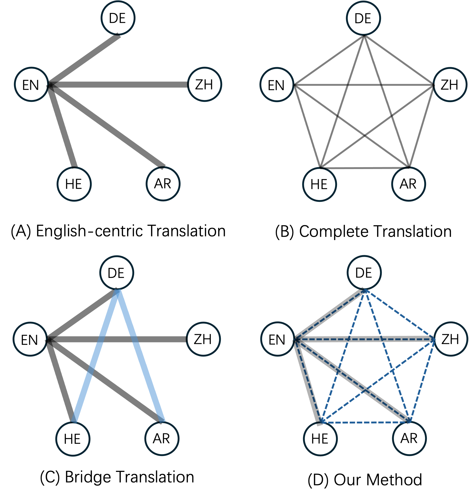

# How Far Can 100 Samples Go?

## Introduction
In this paper, we show that the zero-shot capability of an English-centric model is often overlooked. Surprisingly large non-English improvements can be achieved by simply fine-tuning with a very small amount of multi-parallel data. 

For example, on the EC30 dataset, we obtain up to +21.7 ChrF non-English overall improvements (870 directions) by using
only 100 multi-parallel samples while preserving English-centric translation quality. This performance exceeds M2M100 by an average of 5.9 ChrF++ in the involved non-English directions.

<div style="text-align:center;">
    
</div>

When investigating the size effect of fine-tuning data and its transfer capabilities, we found that :
1) Already a small, randomly sampled set of fine-tuning directions is sufficient to achieve comparable improvements.
2) The resulting non-English performance is close to the complete translation upper bound. 
3) **Even in a minimal setting---fine-tuning with only one single sample---the well-known off-target issue is almost completely resolved, explaining parts--but not all---of the observed improvements in translation quality**

## Experiments
### Enviorments
```
python==3.7   
torch==1.12.1+cu113  
torchvision==0.13.1+cu113
torchaudio==0.12.1+cu113   
fairseq
```
### Code, Data, and Models
Please download the models, and put it in correct dir for quick reproducing. Also, you can train your own English-centric 
baseline using the below Dataset.

For the Europarl-8 experiments, you can easily reproduce using following stuffs:
1. Europarl-8 Models:
   1. English-centric Model (baseline): [download](https://drive.google.com/file/d/1DiyqMTsMeP6geJSJRc8G3DDtAUueyuHn/view?usp=sharing)
   2. Upper-bound Model (Complete Translation): [download](https://drive.google.com/file/d/1LNieAwW68sgPz_FuYnpAb_VNooPBXG7l/view?usp=drive_link)
   3. Boosted Model (Tuned with NTREX): [download](https://drive.google.com/file/d/1bP_jD_jZfLJToOaZsgYNTQlju5RBHUhH/view?usp=sharing)
2. Dataset: 
   1. Train Set: Please download and unzip the [dataset](https://drive.google.com/file/d/1A28_aAzmZ53khWtd8Tnx-mBmAMcazC-U/view?usp=drive_link). It contains 1.2M 8-way aligned sentences. 
   2. Finetune Set: Please unzip the [finetune set](https://github.com/research-anonymous/MultiParallelFinetuning4MMT/tree/main/europarl_experiments/data), where train, valid, and test sets are NTREX, Flores-dev and Flores-devtest, respectively.
   3. Raw & preprocessed data, and the fairseq databin for training are all included.
3. Training and Evaluation: 
   1. Code for training and evaluation: [Code](https://github.com/research-anonymous/MultiParallelFinetuning4MMT/tree/main/europarl_experiments/scripts)

[//]: # (For the EC30 experiments, you can easily reproduce using following stuffs:)

[//]: # (1. EC30 Models:)

[//]: # (   1. English-centric Model &#40;baseline&#41;: [download]&#40;https://drive.google.com/file/d/147p6LCBSr5VKoCtBRMEXEXZzONJM35W8/view?usp=drive_link&#41;)

[//]: # (   3. Boosted Model &#40;Tuned with NTREX&#41;: [download]&#40;https://drive.google.com/file/d/1G4mjNXwmVOqNZbrNog7KznYsO1LiFMIx/view?usp=drive_link&#41;)

## Reference
If you find our work or code useful, please cite ([Di Wu et al., 2024](https://aclanthology.org/2024.findings-acl.896/))
```angular2html
@inproceedings{wu2024far,
  title={How Far can 100 Samples Go? Unlocking Zero-Shot Translation with Tiny Multi-Parallel Data},
  author={Wu, Di and Tan, Shaomu and Meng, Yan and Stap, David and Monz, Christof},
  booktitle={Findings of the Association for Computational Linguistics ACL 2024},
  pages={15092--15108},
  year={2024}
}
```